# Franklin Sports - Amazon Replenishment Analytics

*A data-driven supply chain analytics project examining how inventory signals, demand forecasts, and lead times drive Amazon's purchase order behavior for Franklin Sports' Baseball division - enabling proactive replenishment planning instead of reactive response.*

---

## Business Problem

Franklin Sports supplies sporting goods to Amazon at scale. Amazon's ordering behavior is highly intermittent, weeks with no orders followed by sudden large replenishments - making it difficult for Franklin to plan production, position inventory, and balance stockout risk against holding cost.

Although Franklin has access to Amazon's inventory levels, demand forecasts, and purchase order history, the drivers of ordering were not explicitly defined. The core question this project set out to answer:

> **How can Franklin anticipate Amazon's ordering behavior instead of reacting to it?**

---

## Project Objectives

| # | Objective | Business Question |
|---|---|---|
| 1 | Reorder Trigger Analysis | When is Amazon most likely to place a purchase order? |
| 2 | Forecast Signal & Lag Analysis | Do forecast changes signal when Amazon will reorder? |
| 3 | Weekly PO Forecasting | How many units will Amazon order, and when? |
| 4 | Inventory Optimization Simulation | Which replenishment policy minimizes cost while maintaining service levels? |

---

## Dataset Overview

Five datasets were cleaned, validated, and merged at the ASIN–week level, covering **1,283 Baseball SKUs across 48 weeks** — approximately 92,768 ASIN-week observations.

| Dataset | Description | Key Variables |
|---|---|---|
| Product Taxonomy | Master list of Franklin SKUs (Baseball division) | asin, product, division |
| Inventory | Weekly on-hand stock at Franklin warehouses | start_date, onhand_units |
| Predictive Demand | Amazon's weekly demand forecasts (mean + percentiles) | forecast_mean, forecast_p70/p80/p90 |
| Open Purchase Orders | Weekly Amazon order quantities | po_request_date, po_quantity |
| Lead Time | Supplier transit duration by customer channel | lead_time_days, customer_number |

> **Note:** All data is anonymized under NDA. A masked sample is available in `data/masked_merged_sample.csv`.

---

## Key Findings

### Objective 1 - Reorder Trigger (Weeks of Cover)

Amazon reorders consistently when Weeks of Cover (WoC) falls between **4–8 weeks**, with peak probability at **≈ 6 WoC**. Nearly half of all Amazon purchase orders for Franklin products fall within this range. This aligns naturally with Franklin's ≈ 3-week inbound lead time, leaving a meaningful production buffer.

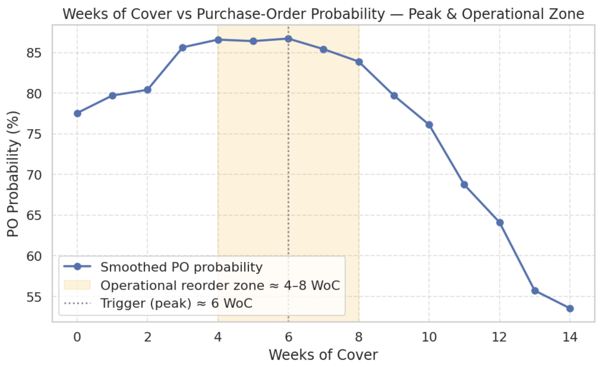

Model precision was validated using a Precision–Recall–F1 sweep across WoC thresholds:

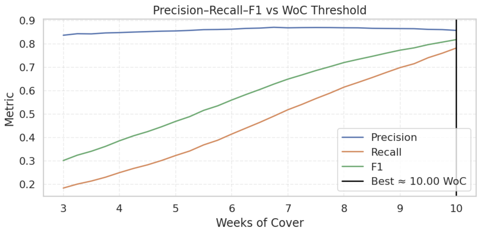

The finding holds across both training and validation periods — confirming a structural ordering rule, not a data artifact:

| Training | Validation |
|---|---|
| 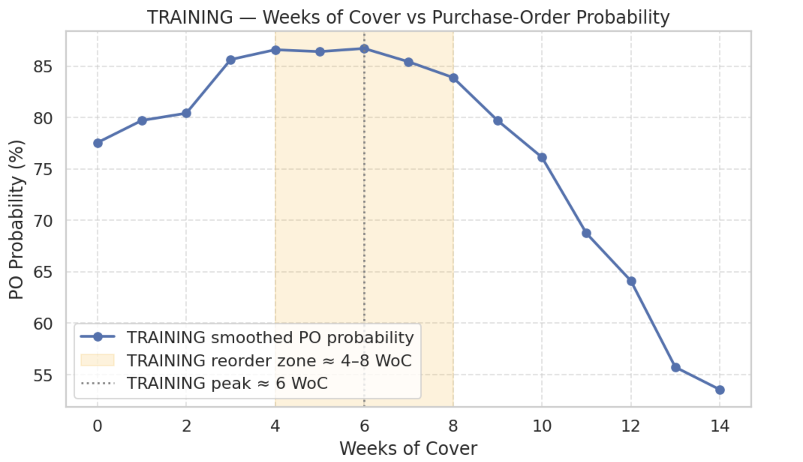 | 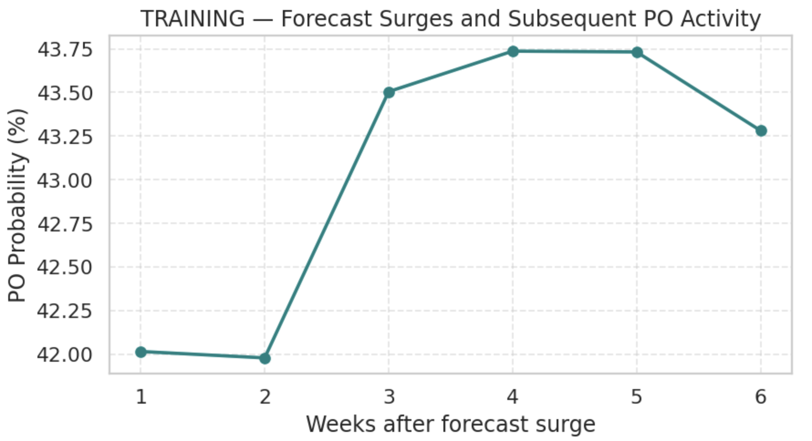 |

**What this means for Franklin:**
- When WoC approaches ~6 weeks, reordering becomes highly likely
- The decision rule is consistent: Amazon reorders when WoC is within 4–8 weeks
- The peak shifted 6 → 4 weeks in validation due to seasonality, but the zone remains unchanged

---

### Objective 2 - Forecast Signal & Lag Analysis

Forecast surges (>20% week-over-week increase) precede purchase orders by approximately **4 weeks**. Near-term forecast levels confirm ordering ~1 week ahead. Combined, these signals create a **6-7 week forward planning window** for Franklin.

| Forecast Lag Correlation | Forecast Change vs PO |
|---|---|
| 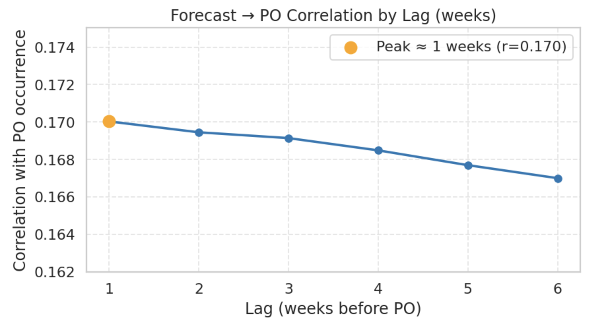 | 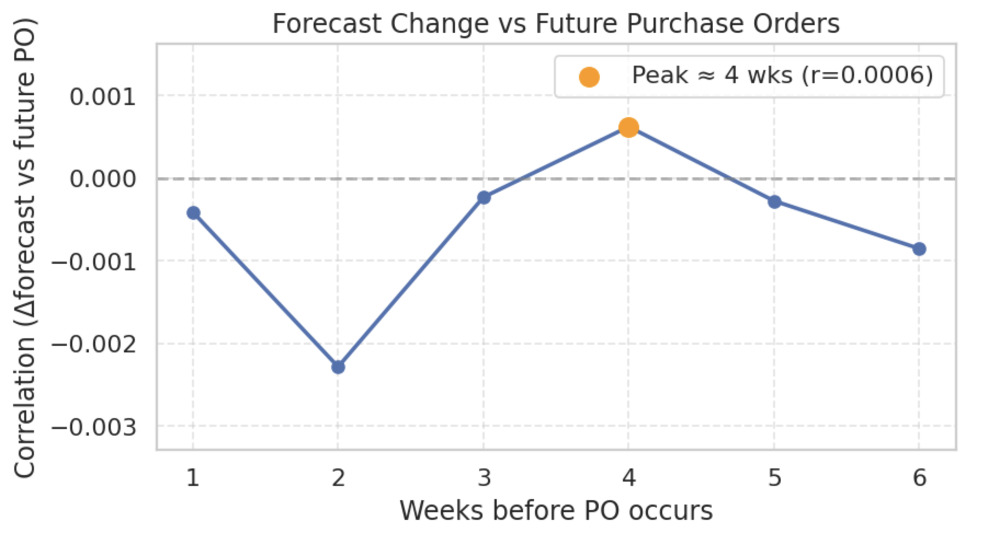 |

The surge-to-PO timing pattern holds across both training and validation periods:

| Training | Validation |
|---|---|
|  |  |

**Replenishment Timeline:**
```
Forecast rises (+20% WoW)  →  ~4 weeks  →  Amazon places PO  →  ~3 weeks  →  Inventory arrives
```

**What this means for Franklin:**
- Forecast surges act as early warning signals - Franklin gains forward visibility into demand acceleration
- Weeks of Cover confirms exact ordering readiness
- Combined signals provide a reliable 6-7 week planning window

---

### Objective 3 - Weekly PO Forecasting

Two models were trained to predict purchase order behavior at the ASIN-week level:

| Model | Task | Performance |
|---|---|---|
| Linear Regression | PO quantity prediction | Strong accuracy on normal demand weeks |
| Logistic Regression | PO occurrence (will Amazon order?) | High recall, interpretable |
| Random Forest Classifier | PO occurrence | Precision ≈ 0.83 \| Recall ≈ 0.74 \| AUC ≈ 0.80 |

Key predictors: Weeks of Cover, lagged forecast shifts, and seasonal event flags (Halloween, Thanksgiving, Cyber Monday, Christmas). The model produces a weekly ranked table of ASINs by PO probability and expected order quantity — a planner-ready view of upcoming replenishment demand.

---

### Objective 4 - Inventory Optimization Simulation

Three replenishment policies were simulated weekly across all Baseball SKUs using EOQ and Safety Stock formulas.

**Single ASIN example - policy comparison across 48 weeks:**

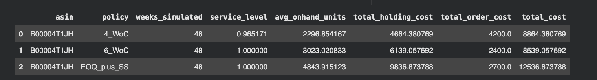

**Results across multiple ASINs:**

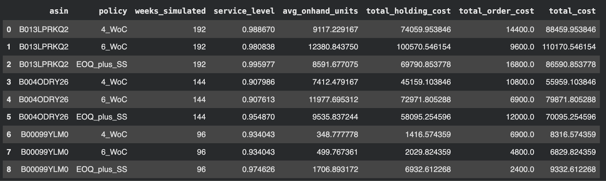

**Aggregate performance summary across all simulated SKUs:**

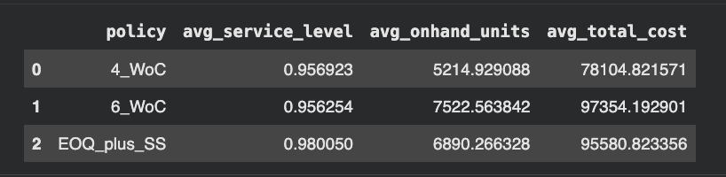

| Policy | Avg Service Level | Avg On-hand Units | Avg Total Cost |
|---|---|---|---|
| 4-WoC | 95.7% | 5,215 | $78,105 |
| 6-WoC | 95.6% | 7,523 | $97,354 |
| EOQ + Safety Stock | **98.0%** | 6,890 | $95,581 |

**Findings:**
- **4-WoC** — lowest cost but higher stockout risk for volatile SKUs
- **6-WoC** — best overall balance between service level and cost; aligns with observed Amazon behavior
- **EOQ + Safety Stock** — most stable service (~98%) but highest holding cost
- No single policy fits all SKUs — **segmentation by demand variability is recommended**

---

## Exploratory Data Analysis

### Data Quality

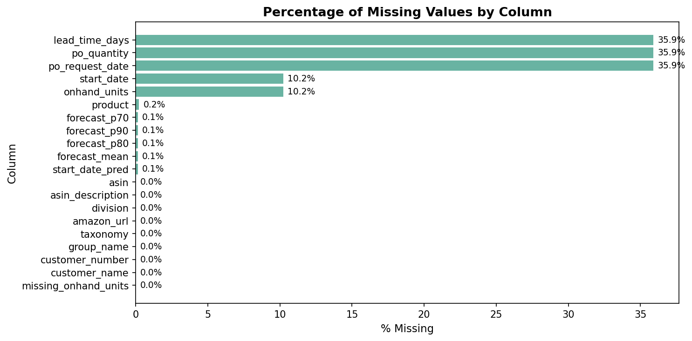

Forecast and inventory data exceeded 95% completeness. Lead time and PO fields showed moderate missingness in Q4, addressed through imputation in the cleaning pipeline.

### Inventory & Forecast Distribution

| On-hand Inventory Distribution | Forecast Distribution (Mean vs P90) |
|---|---|
| 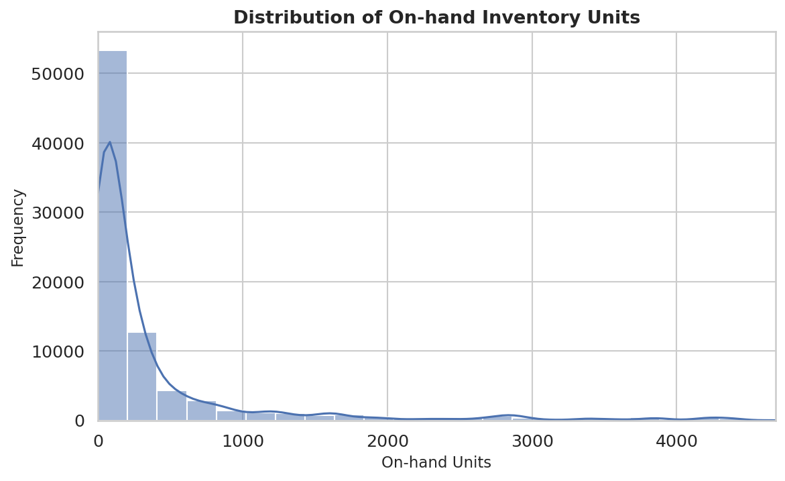 | 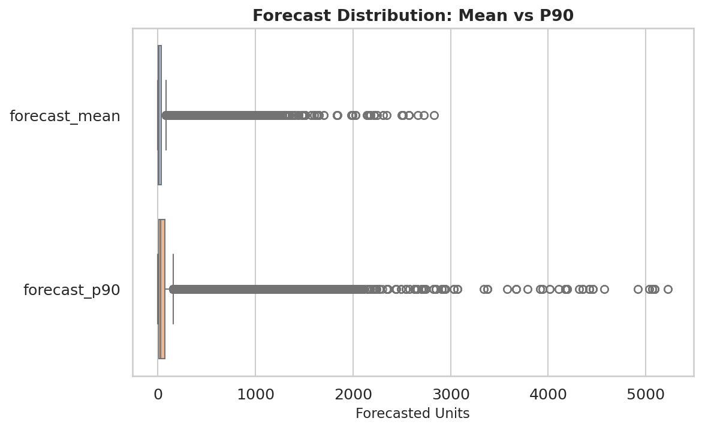 |

On-hand inventory is highly right-skewed — ~80% of SKUs hold fewer than 500 units. P90 forecasts extend significantly beyond the mean, supporting conservative safety stock planning.

### Weeks of Cover & Lead Time

| Weeks of Cover Distribution | Lead Time Distribution |
|---|---|
| 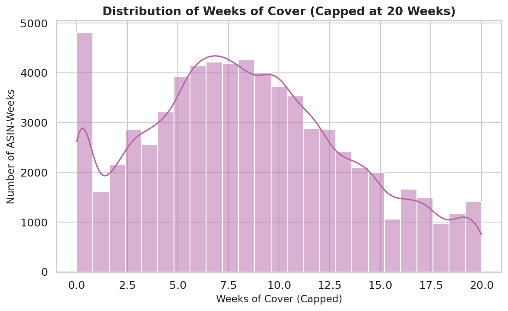 | 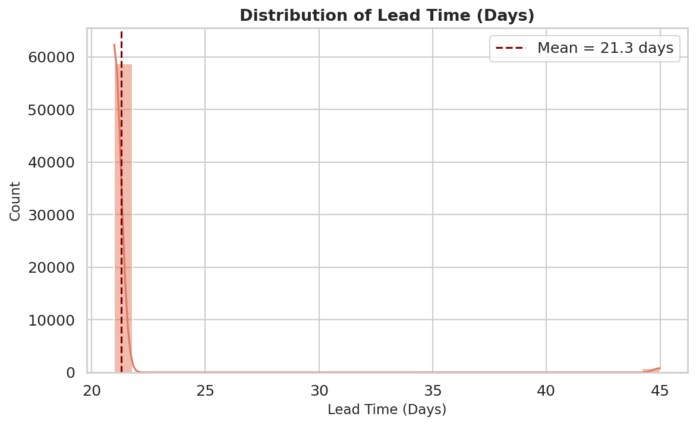 |

Lead times cluster tightly around **21.3 days (≈ 3 weeks)** — confirming high supplier reliability. Stockout risk stems from ordering patterns, not supplier delays.

### Inventory vs Forecast & Top Products

| Inventory vs Forecast | Top 15 Products by Avg Inventory |
|---|---|
| 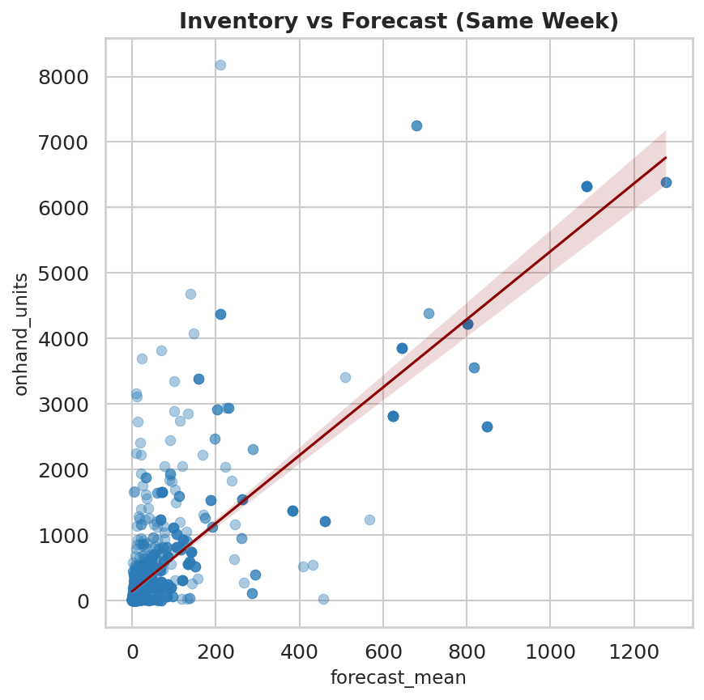 | 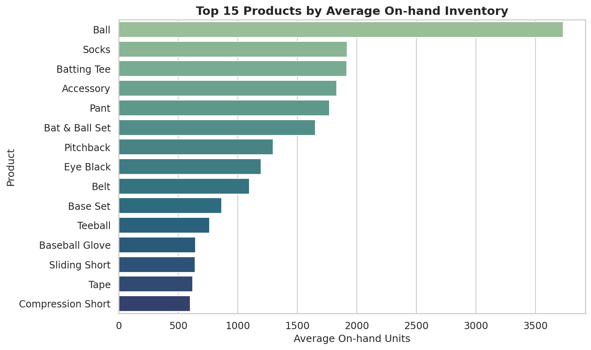 |

### Stockout Risk by Division

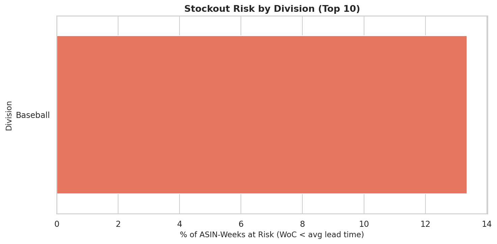

~13% of Baseball division ASIN-weeks fall below the average lead time in Weeks of Cover — the exact exposure the reorder trigger model is designed to prevent.

---

## Technical Implementation

**Languages & Libraries**
- **Python** — pandas, numpy, scikit-learn, matplotlib, seaborn
- **Machine Learning** — Linear Regression, Logistic Regression, Random Forest
- **Statistical Methods** — Pearson correlation, precision-recall analysis, EOQ formula, safety stock modeling
- **Feature Engineering** — Weeks of Cover, lagged forecasts, forecast change rates, seasonal event flags

**Modeling Pipeline**

`Data Cleaning` → `Dataset Merging` → `EDA` → `Reorder Trigger & Forecast Lag` → `PO Forecasting` → `Inventory Simulation`

Each stage is modular and independently runnable from the `src/` directory.

---

## Business Recommendations

1. **Monitor Weeks of Cover weekly** - flag SKUs approaching 6 WoC as high-priority for production scheduling
2. **Track forecast surges as early demand signals** - a >20% WoW forecast increase typically precedes a PO by 4 weeks
3. **Integrate weekly PO forecasts into production planning** - replace reactive scheduling with a forward-looking demand visibility window
4. **Segment inventory policy by SKU demand variability** - apply 6-WoC for high-volume stable SKUs, EOQ+SS for volatile or high-value items
5. **Use forecasts proactively** - the 6-7 week planning window gives Franklin time to align production ahead of Amazon's ordering cycle

---

## Limitations

- Analysis based on a 48-week historical window, multi-year seasonality cannot be fully verified
- Many ASINs show intermittent demand, limiting predictive precision
- Forecast changes may reflect internal Amazon logic not observable in the dataset
- No consumer sell-through signal, analysis relies on Amazon forecasts without downstream demand validation

---

## Technologies Used


---


*This project moves Franklin Sports from reactive replenishment to data-driven planning, providing a 6-7 week forward visibility window, reducing stockout risk, and strengthening alignment with Amazon's purchasing behavior.*
